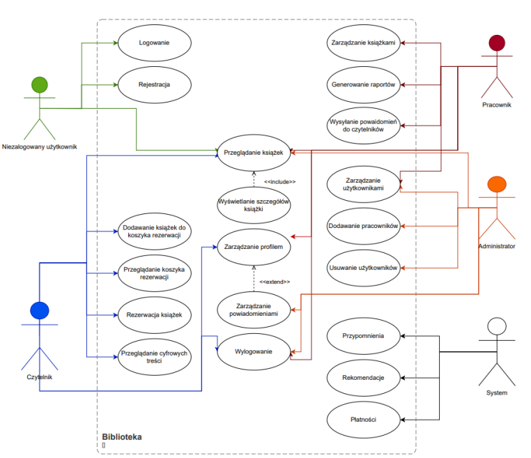
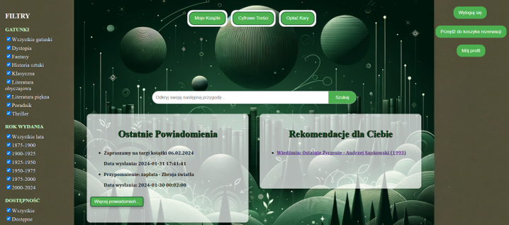
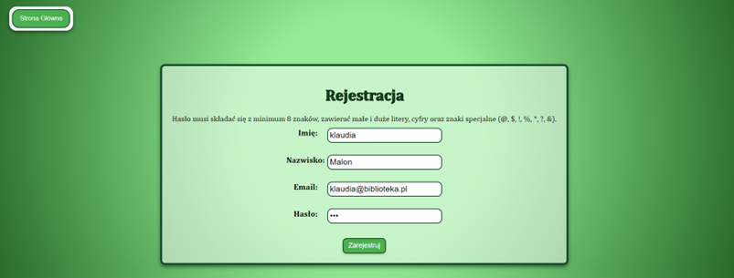
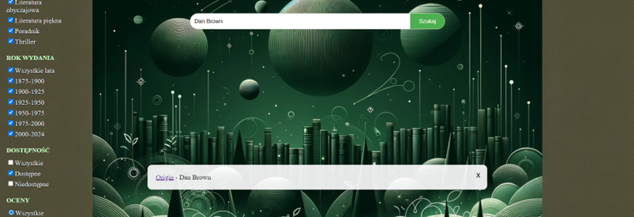
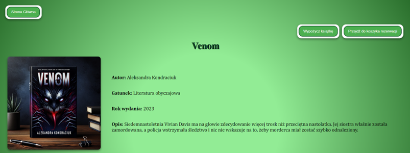
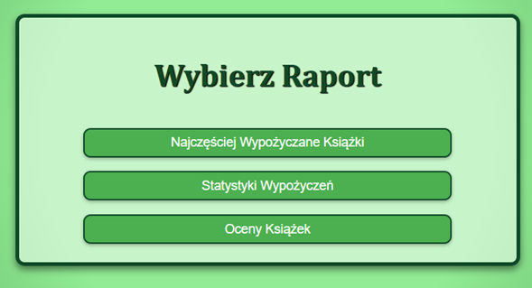
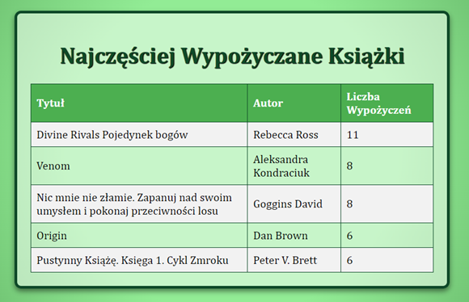

# Library management system based on web technology - frontend

This repository contains the frontend code for a library management application built using Vue.js. The application provides various functionalities for both library staff and readers, enabling them to efficiently manage resources and interact with the library system.

## Technologies

* Vue.js - version 3.2.13
* Vue Router - version 4.2.5
* Vuex - version 4.0.2
* Vuex Persist - version 3.1.3
* Axios - version 1.6.5
* Core-js - version 3.8.3

## Launch

The application requires Node.js to be installed. NPM (Node Package Manager) is installed along with Node.js and is essential for managing project dependencies.

__Official Node.js website:__ https://nodejs.org/en

__Cloning the repository__

`git clone https://github.com/Klau-Klau/library-frontend.git`

__Installing dependencies__

`npm install`

__Running the development server__

`npm run serve`

For the application to function correctly, it is also necessary to run a backend server.

__Link to the backend repository:__ https://github.com/Klau-Klau/biblioteka.git

## Features

* Registration, Login
* Browsing available books in the library with filters and sorting
* Book reservations
* Digital content
* Fees for overdue books
* Profile editing
* Notifications and recommendations
* Adding and editing books
* Reports
* Deleting users

## Screenshots

* Use case diagram for library application



* Home Page



* Registration form for a new user with an example of a password that does not meet requirements



* Example of searching for a book by author



* Book details page
  


* Choice of Report Type for Employees

 

* Most frequently borrowed books report



## Usage

Use cases and code examples

### Registration

```javascript
methods: {
  async submitForm () {
    const passwordPattern = /^(?=.*[a-z])(?=.*[A-Z])(?=.*\d)(?=.*[@$!%*?&])[A-Za-z\d@$!%*?&]{8,}$/;
    if (!passwordPattern.test(this.password)) {
      this.messages = ['Hasło musi składać się z minimum 8 znaków, zawierać małe i duże litery, cyfry oraz znaki specjalne (@, $, !, %, *, ?, &).'];
      return;
    }
    try {
      const response = await this.$axios.post('/api/register', {
        name: this.name,
        surname: this.surname,
        email: this.email,
        password: this.password
      });
      if (response.data.success) {
        this.$router.push('/login');
      } else {
        this.messages = [response.data.error];
      }
    } catch (error) {
      this.messages = ['Wystąpił błąd podczas próby rejestracji.'];
    }
  }
}
```

1. Password Validation: At the beginning of the method, a _passwordPattern_ is defined to check if the password meets specified criteria (at least 8 characters including uppercase, lowercase letters, digits, and special characters). If the password does not meet these requirements, an error message is stored in the _messages_ array, and the function returns control without further execution.
2. Registration: Using the Axios HTTP client, an asynchronous request is sent to the _/api/register_ endpoint with the user's data (name, surname, email, password). The server's response is then checked—if the registration is successful, the user is redirected to the login page. If there are any errors, the corresponding message is stored in the _messages_ array.
3. Error Handling: The _catch_ block captures exceptions that may occur during communication with the API, with an appropriate error message being stored in _messages_.

### Book search

```javascript
methods: {
  searchBooks () {
    const queryParams = new URLSearchParams({
      search: this.searchQuery || '',
      genre: this.selectedGenres ? Object.keys(this.selectedGenres).filter(key => this.selectedGenres[key] && key !== 'Wszystkie gatunki').join(',') : '',
      year: this.selectedYearRanges ? Object.keys(this.selectedYearRanges).filter(key => this.selectedYearRanges[key]).join(',') : '',
      availability: this.selectedAvailabilities ? Object.keys(this.selectedAvailabilities).filter(key => this.selectedAvailabilities[key]).join(',') : '',
      rating: this.selectedRating || '',
      sort: this.selectedSort || 'newest'
    }).toString();

    axios.get(`http://localhost:5000/api/search_books?${queryParams}`)
      .then(response => {
        this.searchResults = response.data.books
      })
      .catch(error => {
        console.error('Wystąpił błąd podczas wyszukiwania wyników:', error)
      })
  }
}
```

This code snippet describes the _searchBooks()_ method, which is invoked to search for books based on user-specified filters. The method begins by constructing query parameters using the _URLSearchParams_ object. These parameters include: search text, selected genres, year ranges, availability, rating, and sorting method. These filters are dynamically created based on the options currently selected by the user. GET request is then made to the API at _http://localhost:5000/api/search_books_ using the Axios library, passing the constructed query parameters as part of the URL. Upon receiving a response, book data is stored in the _searchResults_ variable. In case of errors during the query execution, these errors are logged in the console.

### Loan

```javascript
methods: {
  fetchLoanStatistics () {
    this.$axios.get('/api/reports/loan_statistics')
      .then(response => {
        this.loanStatistics = response.data.loan_statistics
      })
      .catch(error => {
        console.error('Błąd podczas pobierania statystyk wypożyczeń:', error)
      })
  }
}
```
The _fetchLoanStatistics_ method is a JavaScript function designed to retrieve loan statistics data from the server using an API. It utilizes the Axios library to make a GET request to the endpoint _/api/reports/loan_statistics_. Upon receiving a response from the server, the loan statistics data are assigned to the local variable _loanStatistics_. In case of errors during the request, the error is logged to the console using _console.error_. This allows for dynamic updating of data on the user interface in the web application.

## Project Status

The project is complete. However, in the future, I want to develop some functionalities further:

* Expansion of mobile device functionality: Development of a dedicated mobile application. This would allow readers to easily use the library application on their phones.
* Development of the recommendation module: Implementation of more advanced recommendation algorithms, such as those based on machine learning. This would enable better matching of recommendations based on individual user preferences and their borrowing history.
* Expansion of the digital content module: Adding the option to browse the contents of books online without the need to download files and the ability to listen to audiobooks directly from the browser would increase the accessibility and appeal of the library's digital resources.

## Contact


Link to the LinkedIn profile

https://www.linkedin.com/in/klaudia-malon-898330305/